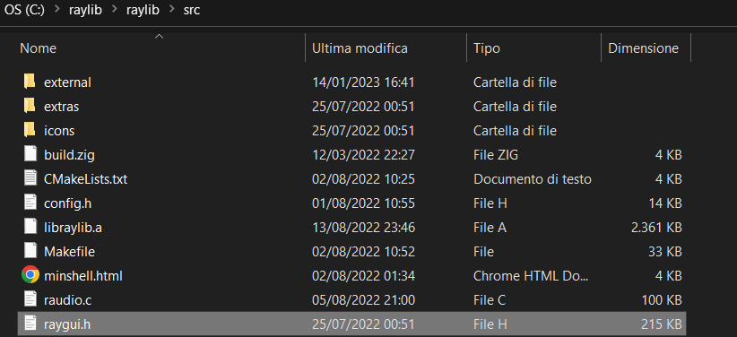

# Apple Eater
Un progetto fatto in C con l'utilizzo libreria raylib e creato delle intefaccie utente con l'uso della libreria raygui
## Raylib e Raygui setup
### VSCode
Link del setup di Raylib per VSCode: [Raylib VSCode Setup](<https://github.com/raysan5/raylib/wiki/Using-raylib-in-VSCode>).

Per Raygui, prendere il file, raygui.h, da questo percorso

e spostarlo o copiarlo su questo percorso

### Code Blocks
Link del setup di Raylib per Code Blocks: [Raylib Code Blocks Setup](<https://github.com/raysan5/raylib/wiki/Use-raylib-with-Code-Blocks>).

Per Raygui, prendere il file, raygui.h, da questo percorso

e spostarlo o copiarlo su questo percorso
